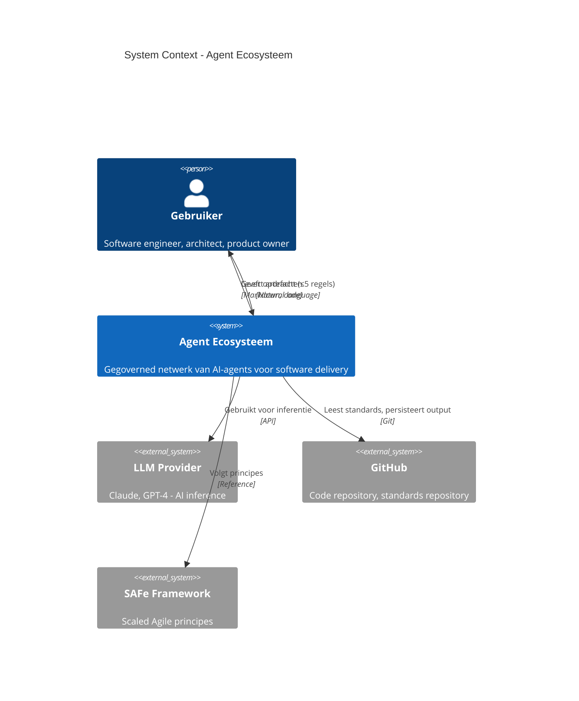
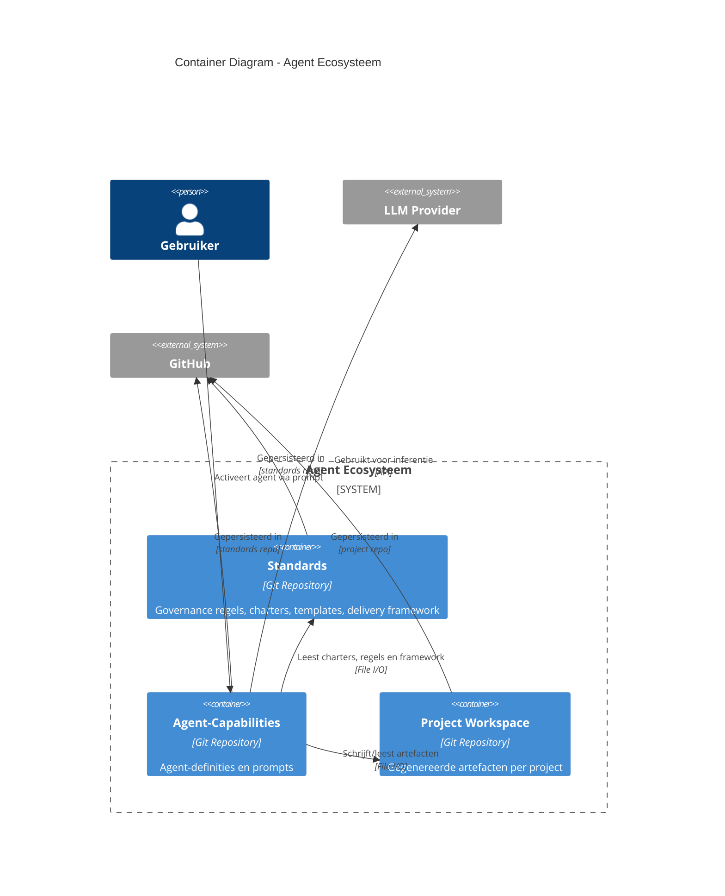
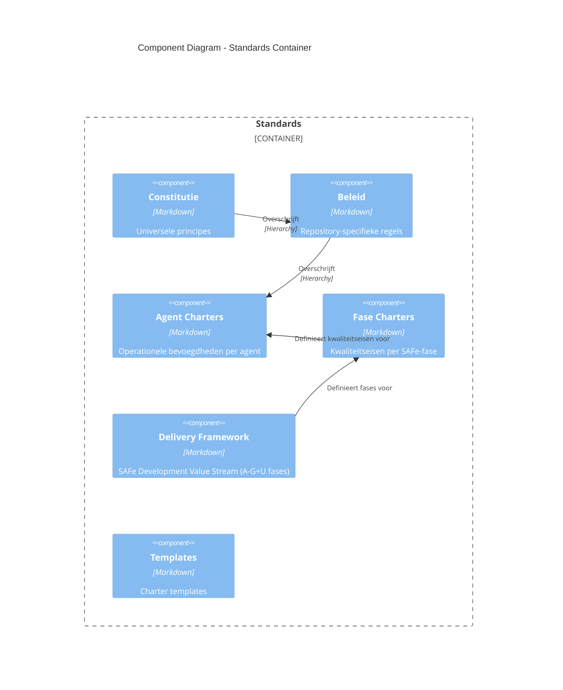
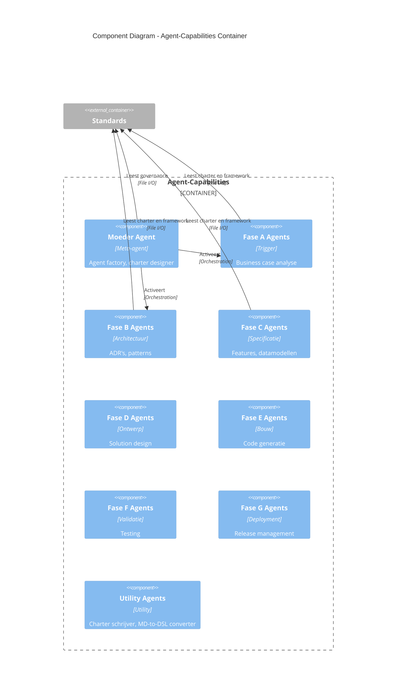
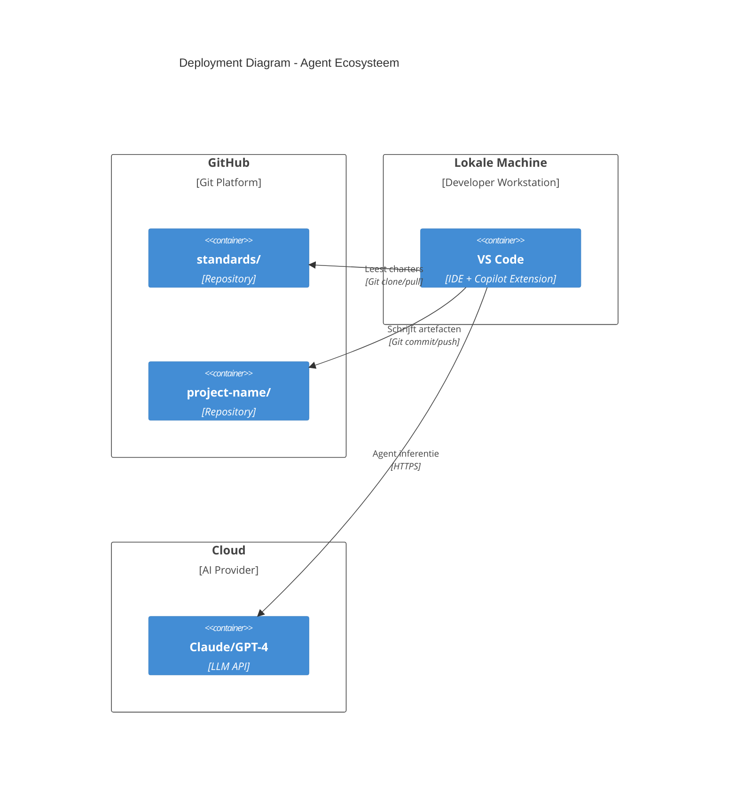

# Architectuur: Agent Ecosysteem

## 1. Inleiding

Dit document beschrijft de **software-architectuur van het Agent Ecosysteem** — het systeem dat we bouwen om software te specificeren, ontwerpen, bouwen en valideren met AI-agents.

**Belangrijke scheiding**:
1. **Dit document** beschrijft WAT we bouwen (de architectuur van het ecosysteem zelf)
2. Een apart document beschrijft HOE we het bouwen (het stappenplan/value stream voor het opzetten van het ecosysteem)

Deze architectuur volgt C4-model principes en toont de **statische structuur** van het ecosysteem.

---

## 2. System Context



### Externe Actors

**Gebruiker**: Geeft natuurlijke taal opdrachten aan het ecosysteem. Verwacht werkende artefacten (specs, designs, code, tests).

**LLM Provider**: Levert AI inference capabilities (Claude, GPT-4, etc.). Het ecosysteem is model-agnostisch.

**GitHub**: 
- **Standards Repository** (`standards/`): Bevat governance, charters, templates
- **Project Repository**: Bevat gegenereerde artefacten (specs, designs, code)

**SAFe Framework**: Externe referentie voor Development Value Stream principes en best practices.

---

## 3. Container Diagram

Het Agent Ecosysteem bestaat uit **3 primaire containers**:



### Container: Standards

**Type**: Git Repository  
**Locatie**: `github.com/org/standards/`

**Verantwoordelijkheid**: Bevat alle governance en kwaliteitsregels voor het ecosysteem.

**Structuur**:
```
standards/
├── governance/
│   ├── constitutie.md
│   ├── beleid.md
│   ├── delivery-framework.md
│   └── kwaliteitseisen-specificaties.md
├── agent.charters/
│   ├── std.agent.charter.moeder.md
│   ├── std.agent.charter.c.feature-analist.md
│   └── ...
├── fase.charters/
│   ├── std.fase.charter.c.specificatie.md
│   └── ...
└── templates/
    ├── agent.charter.template.md
    └── fase.charter.template.md
```

**Kenmerken**:
- Versioned (Git)
- Read-only voor agents (behalve utility agents zoals Charter Schrijver)
- Binding voor alle agents
- Hierarchie: Constitutie > Beleid > Agent Charters

### Container: Agent-Capabilities

**Type**: Git Repository  
**Locatie**: `github.com/org/standards/.github/`

**Verantwoordelijkheid**: Bevat alle agent-definities en prompt-configuraties.

**Structuur**:
```
standards/.github/
├── agents/
│   ├── std.moeder.agent.md
│   ├── std.u.charter-schrijver.agent.md
│   ├── std.c.feature-analist.agent.md
│   └── ...
└── prompts/
    ├── std.moeder.prompt.md
    ├── std.u.charter-schrijver.prompt.md
    └── ...
```

**Kenmerken**:
- Agent-files: Volledige agent-prompt met roldefinitie, werkwijze, output-formaat
- Prompt-files: Minimale configuratie (agent-reference)
- Naamgeving: `std.<fase>.<naam>` (fase-gebonden) of `std.<naam>` (meta-agents)
- Elke agent MOET beide bestanden hebben

---

## 5. Component Diagram: Agent-Capabilities

**Type**: Git Repository  
**Locatie**: `github.com/org/project-name/`

**Verantwoordelijkheid**: Bevat alle gegenereerde artefacten voor een specifiek project.

**Structuur**:
```
project-name/
├── specs/
│   ├── features/
│   ├── user-stories/
│   └── datamodel.md
├── designs/
│   ├── adr/
│   ├── api-contracts/
│   └── solution-design.md
├── src/
│   └── (gegenereerde code)
├── tests/
│   └── (test cases)
└── docs/
    └── (technische documentatie)
```

**Kenmerken**:
- Per project een aparte repository
- Agents schrijven EN lezen uit workspace (artefact-flow tussen fases)
- Versioned (Git) voor traceerbaarheid
- Input voor volgende fase = output van vorige fase

---

## 4. Component Diagram: Standards



**Governance Hierarchie**:
1. **Constitutie** — Absoluut, universeel, bindend
2. **Beleid** — Context-specifiek (bijv. Nederlands B1)
3. **Delivery Framework** — SAFe proces-definitie (A-G+U fases)
4. **Fase Charters** — Kwaliteitseisen per fase
5. **Agent Charters** — Operationele bevoegdheden

**Delivery Framework** (component binnen Standards):
- **Type**: Markdown bestand (`governance/delivery-framework.md`)
- **Verantwoordelijkheid**: Definieert SAFe Development Value Stream fases
- **Fases**: A (Trigger), B (Architectuur), C (Specificatie), D (Ontwerp), E (Bouw), F (Validatie), G (Deployment), U (Utility)
- **Kenmerken**: 
  - Fase-definities met doel en verantwoordelijkheden
  - Entry/exit criteria per fase
  - Lineaire flow (A→B→C→D→E→F→G) met feedback loops
  - Utility (U) staat los van lineaire flow
  - Basis voor fase-charters

---

## 5. Component Diagram: Agent-Capabilities



**Moeder Agent** (Meta-agent):
- Bepaalt welke agents nodig zijn
- Creëert en valideert charters
- Bewaakt scope en overlap
- Positioneert agents in juiste fase

**Fase Agents** (A-G):
- Exact 1 fase per agent-groep
- Single Responsibility per agent
- Lezen charter voor uitvoering
- Schrijven artefacten naar Project Workspace

**Utility Agents** (U):
- Geen fase-binding
- Cross-cutting concerns
- Voorbeelden: Charter Schrijver, MD-to-DSL Converter

---

## 6. Data Flow: Feature Specificatie (Voorbeeld)
sequenceDiagram
    participant User
    participant Moeder as Moeder Agent
    participant Standards
    participant FaseC as Fase C Agent (Feature-Analist)
    participant Workspace as Project Workspace
    
    User->>Moeder: "Specificeer feature: Gebruikersbeheer"
    Moeder->>Standards: Lees agent charter (feature-analist)
    Moeder->>FaseC: Activeer Feature-Analist
    
    FaseC->>Standards: Lees fase charter (Specificatie)
    FaseC->>Workspace: Lees datamodel (uit Fase B)
    FaseC->>FaseC: Analyseer, stel vragen, schrijf user stories (INVEST, BDD)
    FaseC->>Workspace: Schrijf feature-spec.md
    FaseC->>Workspace: Schrijf user-stories/*.md
    
    FaseC->>User: Levert artefacten + validatie (13 quality gates)
```

**Artefact Flow**:
- Fase B (Architectuur) levert: Datamodel, ADR's
- Fase C (Specificatie) leest datamodel, schrijft features en user stories
- Fase D (Ontwerp) leest features, schrijft solution design

---

## 7. Deployment View



**Runtime Environment**: VS Code met GitHub Copilot (of equivalent)  
**Standards**: Git-gebaseerd, lokaal gecached  
**Workspace**: Git-gebaseerd, per project  
**LLM**: Cloud API (model-agnostisch)

---

## 8. Architectuurprincipes

### 8.1 Separation of Concerns

**Regels** (Standards) ≠ **Proces** (Framework) ≠ **Data** (Workspace)

- Standards: Wat mag en wat niet
- Framework: Wanneer gebeurt wat
- Workspace: Waarmee wordt gewerkt

Geen mixing van verantwoordelijkheden.

### 8.2 Charter-First

Geen agent zonder volledig charter. Charter definieert:
- Doel, scope, grenzen
- Inputs, outputs
- Kwaliteitscriteria
- Anti-patterns

### 8.3 Single Responsibility

Elke agent heeft exact 1 primaire verantwoordelijkheid. Bij groei: splitsen, niet uitbreiden.

### 8.4 Artefact-Driven

Alle communicatie via expliciete artefacten (Markdown, code). Geen gedeelde state, geen impliciete context.

### 8.5 Git as Source of Truth

Alle governance, agents en artefacten zijn Git-versioned voor traceerbaarheid en rollback.

---

## 9. Kwaliteitsattributen

### Schaalbaarheid
- Nieuwe agents toevoegen zonder bestaande agents aan te passen
- Nieuwe fases toevoegen door framework uit te breiden
- Nieuwe projecten = nieuwe workspace repository

### Auditbaarheid
- Elke agent-actie is herleidbaar naar charter
- Elke artefact is Git-versioned
- Governance hierarchie is expliciet

### Evoluerbaarheid
- Agents aanpassen door charter te updaten
- Agent-scope verkleinen door opsplitsing
- Framework uitbreiden door nieuwe fases

### Automatiseerbaarheid
- Agents zijn script-activeerbaar
- Validatie is automatisch (quality gates)
- End-to-end generatie mogelijk

---

## 10. Belangrijke Beslissingen

### ADR: Git Repository als Container

**Besluit**: Standards, Agent-Capabilities en Project Workspace zijn Git repositories (niet runtime componenten).

**Rationale**: 
- Versioning is cruciaal voor governance
- Git is universeel toegankelijk
- Traceerbaarheid out-of-the-box
- Simpele deployment (clone)

**Alternatieven overwogen**: Database, object store, wiki

### ADR: Moeder Agent is GEEN Runtime Container

**Besluit**: Moeder Agent is een Meta-agent (capability), geen persistente orchestrator.

**Rationale**:
- Agent Ecosysteem is een **generator-systeem**, niet een runtime platform
- Moeder Agent activeert andere agents, maar is zelf niet persistent
- Vergelijk: Een ontwikkelteam bouwt een applicatie, maar is geen onderdeel van de applicatie-architectuur

**Implicatie**: C4 diagram toont ALLEEN wat we bouwen (repositories, artefacten), NIET hoe we het bouwen (meta-agents).

### ADR: SAFe als Delivery Framework

**Besluit**: Gebruik SAFe Development Value Stream fases (A-G+U).

**Rationale**:
- Bewezen framework voor enterprise software delivery
- Explicite fases met duidelijke verantwoordelijkheden
- Ondersteunt kwaliteit en compliance
- Breed geaccepteerd in de industrie

---

## Conclusie

Deze architectuur beschrijft **wat we bouwen**: een ecosysteem van repositories (Standards, Agent-Capabilities, Project Workspace) die samen een governanced agent-platform vormen.

**Volgende stap**: Beschrijf **hoe we het bouwen** in een apart document (stappenplan/value stream voor het opzetten van het ecosysteem).
