# Stappenplan: Opbouw Agent Ecosysteem

## Inleiding

Dit document beschrijft **HOE we het Agent Ecosysteem opbouwen** — het stappenplan van 0 naar een werkend, geautomatiseerd agent-platform.

Dit is een **Value Stream** voor het ecosysteem zelf, niet te verwarren met de SAFe Development Value Stream die agents gebruiken voor software delivery.

**Relatie met architectuur**: Het stappenplan realiseert de architectuur beschreven in `architectuur-agent-eco-systeem.md`.

---

## Overzicht: De 9 Fases

```mermaid
graph LR
    F1[1. Architectuur<br/>Definiëren] --> F2[2. Repositories<br/>Inrichten]
    F2 --> F3[3. Governance<br/>Vastleggen]
    F3 --> F4[4. Framework<br/>Kiezen]
    F4 --> F5[5. Charters<br/>Schrijven]
    F5 --> F6[6. Agents<br/>Creëren]
    F6 --> F7[7. Agents<br/>Testen]
    F7 --> F8[8. Agent<br/>Orchestratie]
    F8 --> F9[9. Volledig<br/>Geautomatiseerd]
    
    style F1 fill:#e3f2fd
    style F2 fill:#e3f2fd
    style F3 fill:#fff3e0
    style F4 fill:#fff3e0
    style F5 fill:#ffebee
    style F6 fill:#ffebee
    style F7 fill:#f3e5f5
    style F8 fill:#e8f5e9
    style F9 fill:#e8f5e9
```



**Kleuren**:
- 🔵 Blauw (1-2): Foundation - Structuur neerzetten
- 🟠 Oranje (3-4): Governance - Regels en proces
- 🔴 Rood (5-6): Agents - Capabilities bouwen
- 🟣 Paars (7): Validatie - Agents testen
- 🟢 Groen (8-9): Automatisering - Orkestratie en autonomie

---

## Fase 1: Architectuur Definiëren

**Doel**: Documenteer WAT we gaan bouwen voordat we beginnen.

### Activiteiten

1. **Schrijf architectuurdocument** (`architectuur-agent-eco-systeem.md`)
   - System Context diagram
   - Container diagram (Standards, Agent-Capabilities, Delivery Framework, Project Workspace)
   - Component diagrams per container
   - Data flow voorbeelden
   - Deployment view
   - Architectuurprincipes en ADR's

2. **Creëer Structurizr workspace** (`workspace.dsl`)
   - C4 model in DSL
   - Renderbare diagrammen
   - Views voor alle niveaus

3. **Valideer met stakeholders**
   - Architectuur-review
   - Feedback verwerken
   - Sign-off

### Entry Criteria
- ✅ Duidelijke visie op eindbeeld (≤5 regels → werkende software)

### Exit Criteria
- ✅ Architectuurdocument volledig
- ✅ C4 diagrammen renderbaar in Structurizr
- ✅ Stakeholder sign-off

### Artefacten
- `architectuur-agent-eco-systeem.md`
- `workspace.dsl`

### Duur
**1-2 dagen** (met reviews)

---

## Fase 2: Repositories Inrichten

**Doel**: Creëer de fysieke structuur voor Standards en Project Workspaces.

### Activiteiten

1. **Creëer Standards Repository**
   ```bash
   mkdir standards
   cd standards
   git init
   
   # Basis structuur
   mkdir -p governance
   mkdir -p agent.charters
   mkdir -p fase.charters
   mkdir -p templates
   mkdir -p desc-agents
   mkdir -p .github/agents
   mkdir -p .github/prompts
   mkdir -p agent-eco-systeem
   ```

2. **Creëer README structuur**
   - Repository purpose
   - Folder uitleg
   - Naamgevingsconventies

3. **Configureer Git**
   - `.gitignore` (index/, IDE bestanden)
   - Branch protection (main)
   - PR templates (voor charter changes)

4. **Creëer Project Workspace Template**
   ```bash
   mkdir -p project-template/specs
   mkdir -p project-template/designs
   mkdir -p project-template/src
   mkdir -p project-template/tests
   mkdir -p project-template/docs
   ```

### Entry Criteria
- ✅ Architectuur gevalideerd (Fase 1)
- ✅ GitHub organisatie/account beschikbaar

### Exit Criteria
- ✅ Standards repository bestaat met correcte structuur
- ✅ Project workspace template beschikbaar
- ✅ Git configuratie compleet

### Artefacten
- `standards/` repository
- `project-template/` structure
- `README.md` per folder

### Duur
**2-4 uur**

---

## Fase 3: Governance Vastleggen

**Doel**: Schrijf de bindende regels waaraan alle agents zich moeten houden.

### Activiteiten

1. **Schrijf Constitutie** (`governance/constitutie.md`)
   - Universele principes (Charter-first, Single Responsibility)
   - Niet-onderhandelbare wetten
   - Escalatieregels

2. **Schrijf Beleid** (`governance/beleid.md`)
   - Repository-specifieke regels
   - Taalgebruik (Nederlands B1)
   - Naamgevingsconventies
   - Outputformaten

3. **Creëer Templates** (`templates/`)
   - `agent.charter.template.md` (10 secties)
   - `fase.charter.template.md` (SAFe fase-structuur)

4. **Schrijf Kwaliteitseisen** (`governance/kwaliteitseisen-specificaties.md`)
   - INVEST principes
   - BDD format (Given-When-Then)
   - Definition of Ready/Done

### Entry Criteria
- ✅ Repositories ingericht (Fase 2)
- ✅ Consensus over principes

### Exit Criteria
- ✅ Constitutie compleet en gereviewed
- ✅ Beleid vastgelegd
- ✅ Templates beschikbaar voor agents en fases
- ✅ Governance hierarchie duidelijk (Constitutie > Beleid > Charters)

### Artefacten
- `governance/constitutie.md`
- `governance/beleid.md`
- `governance/kwaliteitseisen-specificaties.md`
- `templates/agent.charter.template.md`
- `templates/fase.charter.template.md`

### Duur
**1-2 dagen**

---

## Fase 4: Framework Kiezen

**Doel**: Selecteer en documenteer het delivery framework (SAFe).

### Activiteiten

1. **Documenteer Delivery Framework** (`governance/delivery-framework.md`)
   - SAFe Development Value Stream
   - Fases: A (Trigger) → G (Deployment) + U (Utility)
   - Fase-doelen en verantwoordelijkheden
   - Artefact-flow tussen fases

2. **Schrijf Fase-Charters**
   - Voor elke fase (A-G):
     - `fase.charters/std.fase.charter.a.trigger.md`
     - `fase.charters/std.fase.charter.b.architectuur.md`
     - `fase.charters/std.fase.charter.c.specificatie.md`
     - etc.
   - Gebruik fase.charter.template.md
   - Bevat: Doel, Entry/Exit criteria, Kernactiviteiten, Kwaliteitsprincipes, Anti-patterns

3. **Valideer SAFe-alignment**
   - Vergelijk met officiële SAFe documentatie
   - Pas toe op context (AI-agents vs teams)

### Entry Criteria
- ✅ Governance vastgelegd (Fase 3)
- ✅ SAFe principes begrepen

### Exit Criteria
- ✅ Delivery Framework gedocumenteerd
- ✅ Alle fase-charters geschreven (A-G+U)
- ✅ Fase-flow gevalideerd

### Artefacten
- `governance/delivery-framework.md`
- `fase.charters/std.fase.charter.*.md` (8 bestanden)

### Duur
**2-3 dagen**

---

## Fase 5: Charters Schrijven

**Doel**: Schrijf agent-charters voor de eerste golf agents.

### Activiteiten

1. **Identificeer eerste agents** (prioriteit op basis van flow)
   - **Meta-agents**:
     - Moeder Agent (orchestrator)
     - Charter Schrijver Agent (utility)
   - **Fase C agents** (kritisch pad):
     - Feature-Analist
     - Datamodel-Analist
   - **Fase B agents**:
     - ADR Schrijver
   - **Fase E agents**:
     - Code Generator

2. **Schrijf charters per agent**
   - Gebruik `agent.charter.template.md`
   - 10 verplichte secties:
     1. Metadata (versie, fase, type)
     2. Doel en klantwaarde
     3. Scope (WEL/NIET)
     4. Inputs en Outputs
     5. Werkwijze (stappen)
     6. Kwaliteitscriteria
     7. Anti-patterns
     8. Beslisbevoegdheid
     9. Afhankelijkheden
     10. Wijzigingslog

3. **Review-cyclus**
   - Peer review per charter
   - Validatie tegen constitutie en beleid
   - Sign-off door Moeder Agent (of architect)

### Entry Criteria
- ✅ Framework en fase-charters beschikbaar (Fase 4)
- ✅ Templates beschikbaar

### Exit Criteria
- ✅ Minimaal 6 agent-charters geschreven
- ✅ Charters gereviewed en geaccepteerd
- ✅ Charters in `agent.charters/` folder

### Artefacten
- `agent.charters/std.agent.charter.moeder.md`
- `agent.charters/std.agent.charter.charter-schrijver.md`
- `agent.charters/std.agent.charter.c.feature-analist.md`
- `agent.charters/std.agent.charter.c.datamodel-analist.md`
- `agent.charters/std.agent.charter.b.adr-schrijver.md`
- `agent.charters/std.agent.charter.e.code-generator.md`

### Duur
**3-5 dagen** (afhankelijk van aantal agents)

---

## Fase 6: Agents Creëren

**Doel**: Vertaal charters naar werkende agent-definities.

### Activiteiten

1. **Creëer agent-files** (`.github/agents/`)
   - Voor elke agent met charter:
     - `std.<fase>.<naam>.agent.md` (fase-gebonden)
     - `std.<naam>.agent.md` (meta-agents)
   - Bevat:
     - Roldefinitie
     - Doel en kernprincipes
     - Wat WEL/NOOIT doet
     - Werkwijze (stappen)
     - Outputformaat
     - Kwaliteitspoorten
     - Escalatieregels

2. **Creëer prompt-files** (`.github/prompts/`)
   - Voor elke agent:
     - `std.<fase>.<naam>.prompt.md`
   - Minimale configuratie:
     ```markdown
     ---
     agent: std.<fase>.<naam>
     ---
     ```

3. **Creëer agent-beschrijvingen** (`desc-agents/`)
   - Beknopte beschrijving per agent
   - `<fase>.<naam>-agent.md`
   - Doel, scope, inputs, outputs (1 pagina)

4. **Valideer volledigheid**
   - Voor elke agent: charter + agent-file + prompt-file + beschrijving
   - Consistentie checks (namen, fase-prefixen)

### Entry Criteria
- ✅ Charters geschreven en goedgekeurd (Fase 5)

### Exit Criteria
- ✅ Voor elke agent: 4 bestanden (charter, agent-file, prompt-file, beschrijving)
- ✅ Alle agents activeerbaar in VS Code
- ✅ Naamgeving consistent

### Artefacten
- `.github/agents/std.*.agent.md` (6+ bestanden)
- `.github/prompts/std.*.prompt.md` (6+ bestanden)
- `desc-agents/*.md` (6+ bestanden)

### Duur
**2-3 dagen**

---

## Fase 7: Agents Testen

**Doel**: Valideer dat elke agent individueel correct functioneert.

### Activiteiten

1. **Unit Testing: Individuele Agents**
   
   Voor elke agent:
   
   **a) Activatietest**
   - Activeer agent via prompt in VS Code
   - Controle: Agent-file wordt geladen
   - Controle: Agent leest correct charter

   **b) Input-validatie**
   - Geef incomplete input
   - Verwacht: Agent vraagt om ontbrekende info
   - Verwacht: Agent escaleert bij ambiguïteit

   **c) Happy Path**
   - Geef complete, correcte input
   - Verwacht: Agent levert artefact conform charter
   - Valideer: Outputformaat klopt
   - Valideer: Kwaliteitspoorten gehaald

   **d) Anti-pattern Check**
   - Probeer agent buiten scope te laten werken
   - Verwacht: Agent weigert of escaleert
   
   **e) Governance Compliance**
   - Valideer: Agent houdt zich aan constitutie
   - Valideer: Agent respecteert beleid (bijv. Nederlands B1)

2. **Testplan per agent**
   - Document testscenario's
   - Verwachte output per scenario
   - Acceptatiecriteria
   - Test-resultaten

3. **Regressietesten**
   - Na charter-wijziging: herhaal tests
   - Bij nieuwe agent: test interacties met bestaande agents

### Entry Criteria
- ✅ Agents gecreëerd en activeerbaar (Fase 6)
- ✅ Test project workspace beschikbaar

### Exit Criteria
- ✅ Elke agent getest (5 checks per agent)
- ✅ Alle tests gedocumenteerd
- ✅ Geen kritieke issues open
- ✅ Agents produceren artefacten conform charter

### Artefacten
- `tests/agents/test-<agent-naam>.md` (testplan per agent)
- `tests/agents/results-<agent-naam>.md` (testresultaten)

### Duur
**3-5 dagen** (afhankelijk van aantal agents)

### Test Voorbeeld: Feature-Analist

**Testscenario 1: Happy Path**
```
Input: "Specificeer feature: Gebruikersbeheer (toevoegen, verwijderen, rollen toekennen)"
Verwacht:
- Agent stelt min. 1 kritische vraag
- Agent leest datamodel uit workspace
- Agent schrijft feature-spec.md (INVEST compliant)
- Agent schrijft user-stories/*.md (BDD format: Given-When-Then)
- Benefit hypothesis aanwezig
- 13 quality gates gevalideerd
```

**Testscenario 2: Incomplete Input**
```
Input: "Schrijf user story"
Verwacht:
- Agent escaleert: "Welke feature? Welk doel?"
- Agent vraagt minimaal 3 context-vragen
```

**Testscenario 3: Anti-pattern Check**
```
Input: "Schrijf ook de code voor deze feature"
Verwacht:
- Agent weigert: "Code schrijven is Fase E (Bouw), ik ben Fase C (Specificatie)"
- Agent suggereert: "Activeer Code Generator agent na design fase"
```

---

## Fase 8: Agent Orchestratie

**Doel**: Laat agents elkaar activeren voor end-to-end flows.

### Activiteiten

1. **Implementeer Moeder Agent Orchestratie**
   
   **Capability: Agent Activatie**
   - Moeder Agent kan andere agents starten
   - Moeder Agent leest charters om te bepalen welke agent nodig is
   - Moeder Agent positioneert agents in correcte fase
   
   **Voorbeeld Flow**:
   ```
   User: "Bouw feature: Gebruikersbeheer"
   
   Moeder Agent:
   1. Analyseert: Dit vereist Fase C (Specificatie)
   2. Activeert: Feature-Analist
   3. Wacht op output
   4. Analyseert: Specificatie compleet, volgende = Fase D (Ontwerp)
   5. Activeert: Solution Designer
   6. Wacht op output
   7. Analyseert: Design compleet, volgende = Fase E (Bouw)
   8. Activeert: Code Generator
   9. Levert: Code + tests + documentatie
   ```

2. **Configureer Agent Handoffs**
   
   - Agent moet volgende agent kunnen identificeren
   - Agent moet artefacten doorsturen (via workspace)
   - Agent moet status teruggeven (success, blocked, escalatie)

3. **Test Multi-Agent Flows**
   
   **Flow 1: Specificatie → Ontwerp**
   - Start: Feature-Analist (Fase C)
   - Output: Feature-spec + User stories
   - Handoff: Solution Designer (Fase D)
   - Output: Solution design + API contracts
   
   **Flow 2: Architectuur → Specificatie → Ontwerp**
   - Start: ADR Schrijver (Fase B)
   - Output: ADR + Datamodel
   - Handoff: Feature-Analist (Fase C)
   - Output: Feature-spec (gebruikt datamodel)
   - Handoff: Solution Designer (Fase D)
   - Output: Solution design

4. **Monitoring en Logging**
   - Log elke agent-activatie
   - Log artefact-flow tussen agents
   - Detecteer loops (agent activeert zichzelf)
   - Detecteer deadlocks (agents wachten op elkaar)

### Entry Criteria
- ✅ Alle agents individueel getest (Fase 7)
- ✅ Moeder Agent operationeel

### Exit Criteria
- ✅ Moeder Agent kan agents activeren
- ✅ Minimaal 2 multi-agent flows succesvol getest
- ✅ Artefact handoffs werken correct
- ✅ Logging operationeel

### Artefacten
- `tests/orchestration/flow-spec-to-design.md`
- `tests/orchestration/flow-arch-to-build.md`
- `logs/agent-activations.log`

### Duur
**3-5 dagen**

---

## Fase 9: Volledig Geautomatiseerd

**Doel**: Ecosysteem draait autonoom zonder menselijke bevestiging per stap.

### Activiteiten

1. **Configureer Autonome Modus**
   
   **GitHub Copilot Configuratie**:
   - Disable confirmation prompts voor agent-activaties
   - Enable auto-commit van artefacten
   - Enable sequential agent execution
   
   **VS Code Settings** (`.vscode/settings.json`):
   ```json
   {
     "github.copilot.agent.confirmActivation": false,
     "github.copilot.agent.autoCommit": true,
     "github.copilot.agent.sequential": true,
     "github.copilot.agent.timeout": 3600
   }
   ```

2. **Implementeer Batch Processing**
   
   **Agent Chain Execution**:
   - User geeft 1 opdracht
   - Moeder Agent bepaalt volledige agent-keten (A→B→C→D→E→F→G)
   - Agents worden sequentieel geactiveerd zonder tussenkomst
   - Elke agent schrijft output naar workspace
   - Volgende agent leest output en start
   
   **Voorbeeld**:
   ```
   User: "Bouw volledige applicatie: Internet banking systeem"
   
   Auto-flow:
   1. Fase A: Business Case Analist (5 min)
   2. Fase B: ADR Schrijver + Datamodel Analist (15 min)
   3. Fase C: Feature-Analist (30 min, meerdere features)
   4. Fase D: Solution Designer (45 min)
   5. Fase E: Code Generator (60 min)
   6. Fase F: Test Generator + Validator (30 min)
   7. Fase G: Deployment Packager (10 min)
   
   Totale runtime: ~3 uur
   Output: Volledige, geteste applicatie
   ```

3. **Error Handling en Recovery**
   
   **Bij Agent Failure**:
   - Agent logt error + context
   - Moeder Agent probeert retry (max 3x)
   - Bij blijvende failure: Escalatie naar gebruiker met:
     - Welke agent gefaald is
     - Wat de input was
     - Wat de error is
     - Welke stap van het proces

   **Bij Quality Gate Failure**:
   - Agent rapporteert welke quality gate gefaald is
   - Agent suggereert correctie
   - Moeder Agent kan vorige fase opnieuw activeren

4. **Long-Running Agent Sessions**
   
   **Implementatie**:
   - Background agent execution (niet blocking voor user)
   - Progress updates via notificaties
   - Cancel functionaliteit
   - Resume capability (bij crash)
   
   **Monitoring Dashboard**:
   - Welke agents zijn actief
   - Welke fase is gaande
   - Welke artefacten zijn gegenereerd
   - ETA voor completion

5. **Validatie: 24-uur Continuous Run**
   
   **Test**:
   - Start ecosysteem met grote opdracht (bijv. "Bouw 5 microservices")
   - Laat agents 24 uur draaien zonder interventie
   - Monitor:
     - Aantal agent-activaties
     - Aantal failures
     - Aantal escalaties
     - Kwaliteit van output
   
   **Acceptatiecriteria**:
   - <5% failure rate
   - Alle escalaties zijn terecht (echte ambiguïteit)
   - Output voldoet aan alle quality gates
   - Geen infinite loops
   - Geen resource exhaustion

### Entry Criteria
- ✅ Agent orchestratie werkt (Fase 8)
- ✅ Multi-agent flows getest

### Exit Criteria
- ✅ Copilot/VS Code configuratie voor autonome modus
- ✅ Agent chains kunnen draaien zonder bevestiging
- ✅ Error handling en recovery operationeel
- ✅ Long-running sessions (>1 uur) succesvol getest
- ✅ 24-uur continuous run succesvol

### Artefacten
- `.vscode/settings.json` (autonome configuratie)
- `monitoring/dashboard.md` (agent status tracking)
- `tests/autonomous/24h-run-report.md`
- `docs/autonomous-mode-guide.md`

### Duur
**5-7 dagen** (inclusief 24-uur test)

---

## Totale Doorlooptijd

| Fase | Activiteit | Duur | Cumulatief |
|------|-----------|------|------------|
| 1 | Architectuur Definiëren | 1-2 dagen | 2 dagen |
| 2 | Repositories Inrichten | 0.5 dag | 2.5 dagen |
| 3 | Governance Vastleggen | 1-2 dagen | 4 dagen |
| 4 | Framework Kiezen | 2-3 dagen | 7 dagen |
| 5 | Charters Schrijven | 3-5 dagen | 12 dagen |
| 6 | Agents Creëren | 2-3 dagen | 15 dagen |
| 7 | Agents Testen | 3-5 dagen | 20 dagen |
| 8 | Agent Orchestratie | 3-5 dagen | 25 dagen |
| 9 | Volledig Geautomatiseerd | 5-7 dagen | **30 dagen** |

**Totaal: ~1 maand** (bij fulltime focus)

**Realistischer: 6-8 weken** (bij parttime werk + reviews + iteraties)

---

## Kritieke Succesfactoren

### 1. Begin Klein, Schaal Op
- Start met 2-3 agents (Moeder + Feature-Analist + Code Generator)
- Test grondig voordat je meer agents toevoegt
- Elke nieuwe agent moet waarde toevoegen

### 2. Charter Kwaliteit is Cruciaal
- Investeer tijd in goede charters
- Review met meerdere ogen
- Update charters op basis van learnings

### 3. Test, Test, Test
- Elke agent individueel testen
- Multi-agent flows testen
- Edge cases en failures testen
- Lange runs (>1 uur) testen

### 4. Itereer op Basis van Data
- Log alles (activaties, failures, escalaties)
- Analyseer patterns
- Verbeter charters op basis van failures
- Splits agents bij scope-creep

### 5. Autonomie Geleidelijk Opbouwen
- Start met menselijke confirmatie per agent
- Ga naar confirmatie per fase
- Uiteindelijk: volledige autonomie
- Altijd escape hatch (cancel knop)

---

## Risico's en Mitigaties

| Risico | Impact | Mitigatie |
|--------|--------|-----------|
| **Agents produceren slechte kwaliteit** | Hoog | Strenge quality gates, mandatory reviews, charter refinement |
| **Infinite loops (agent activeert zichzelf)** | Hoog | Loop detection, max recursion depth, timeouts |
| **Agents buiten scope werken** | Medium | Charter compliance checks, anti-pattern validatie |
| **Lange runtime zonder feedback** | Medium | Progress updates, incremental commits, cancel functie |
| **Charter inconsistenties** | Medium | Charter templates, automated validation, peer reviews |
| **Resource exhaustion (LLM kosten)** | Medium | Rate limiting, budget alerts, caching van artefacten |

---

## Volgende Stappen

**Na Fase 9 (Volledig Geautomatiseerd)**:

1. **Productioniseer**
   - Deploy naar team/organisatie
   - Training voor gebruikers
   - Support-proces opzetten

2. **Monitoren en Optimaliseren**
   - Usage metrics verzamelen
   - Bottlenecks identificeren
   - Agents optimaliseren (snelheid, kwaliteit)

3. **Uitbreiden**
   - Meer agents toevoegen (nieuwe capabilities)
   - Meer fases dekken (volledige A-G dekking)
   - Nieuwe domeinen (niet alleen software, ook data pipelines, infrastructure)

4. **Community Building**
   - Open source standards repository
   - Agent marketplace (contributie van anderen)
   - Best practices delen

---

## Conclusie

Dit stappenplan biedt een pragmatische route van 0 naar een volledig geautomatiseerd Agent Ecosysteem in **~30 dagen intensief werk** of **6-8 weken parttime**.

Kritieke principes:
- **Incrementeel**: Elke fase bouwt op de vorige
- **Validatie-gedreven**: Elke fase heeft duidelijke exit criteria
- **Kwaliteit boven snelheid**: Grondig testen voordat je verder gaat
- **Geleidelijke autonomie**: Eerst handmatig, dan geassisteerd, dan autonoom

Het eindresultaat: Een ecosysteem waarin **≤5 regels input leidt tot een volledige, werkende, geteste applicatie** zonder verdere menselijke tussenkomst.
